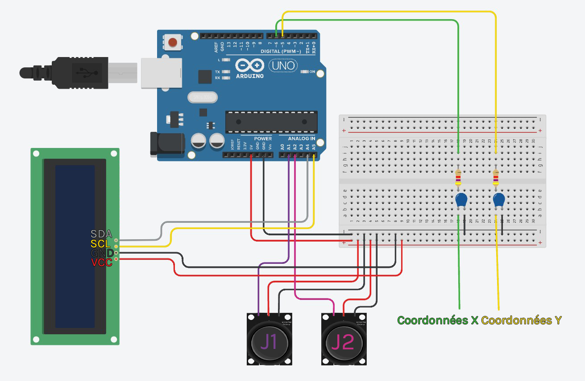

# 🎮 Pong Game on Oscilloscope

## 📢 What is it about ?
It's a school project which was made on an arduino Uno. The idea was to play a video game displayed on an oscilloscope screen. We decide to make the original Pong, which was also designed on an oscilloscope at first. 

# 

Here is a demo video.

## 📐 How it works ?
We are using an Arduino Uno. First, we sets the PWM clock to its maximum value on Arduino. Then, we use pin 5 & 6 to write signals which represent X & Y axis. On oscilloscope, we just use XY Mode to display our signals. We just need first to filter our axis signals in order to have lines between points (because of the capacitor). Then, we just need to design all objects coordinates for the game. For the end, we developp a simple game as Pong.

We used 2 joysticks for the players, and a LCD screen to print the score & the time left for the game.

## 📋 How to play on your arduino & oscilloscope ?

### 📌 1 ) Electronic Layout :

In order to test the project, you will need all this stuff :
- an Arduino Uno
- an oscilloscope
- 2 capacitors of 100 nF
- 2 resistors of 4.7 kΩ (it works with 1kΩ or 10kΩ but the visuals are not so clean)
- cables
- 2 joysticks
- a LCD Screen (optional)

Then, you can create your electronic assembly by following this layout :

# 

Note : Don't forget to plug the ground pin from Arduino to the oscilloscope.

### 📟 2 ) Oscilloscope Settings :

- You need to be in XY display Mode.
- The screen will take 2V in height & 2V in width, so if you have 10 subdivisions on screen like us, take 200mV per subdivision.
- The screen sample interval must be 5ms.
- You will also need a -1V screen offset in X & Y to center the game visuals.

### 🎮 3 ) Test the game :

Get the code, and upload it on the arduino. The game will start.
Once a game is finished, you can restart another one by putting the two joysticks in down position. 

The SEGMENT "VARIABLE CONFIGURATION" in code, can be edited if you want to change some settings of the game.